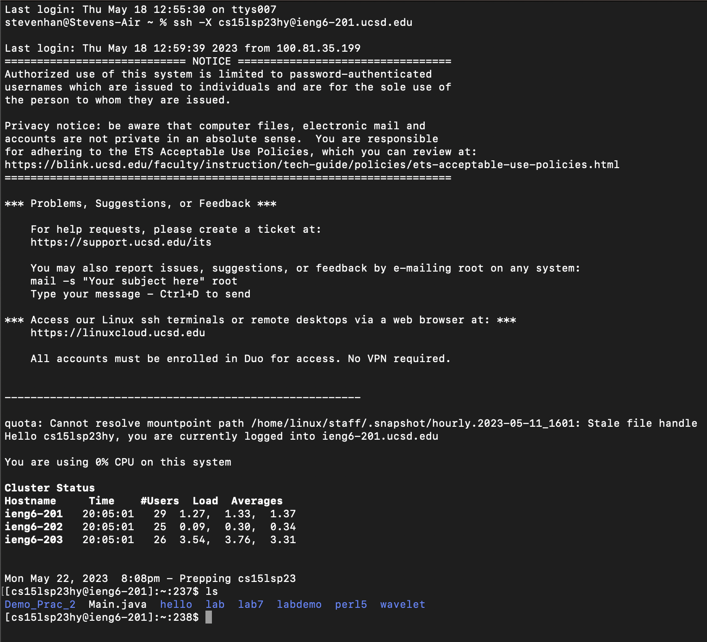
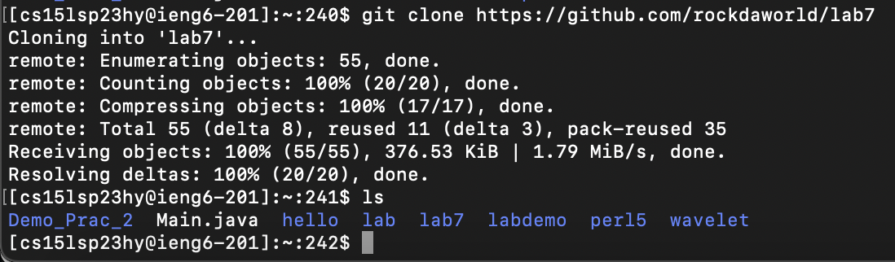
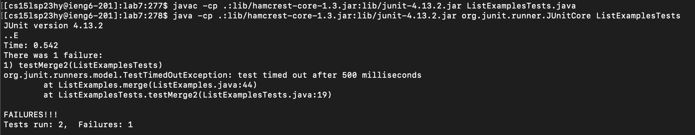
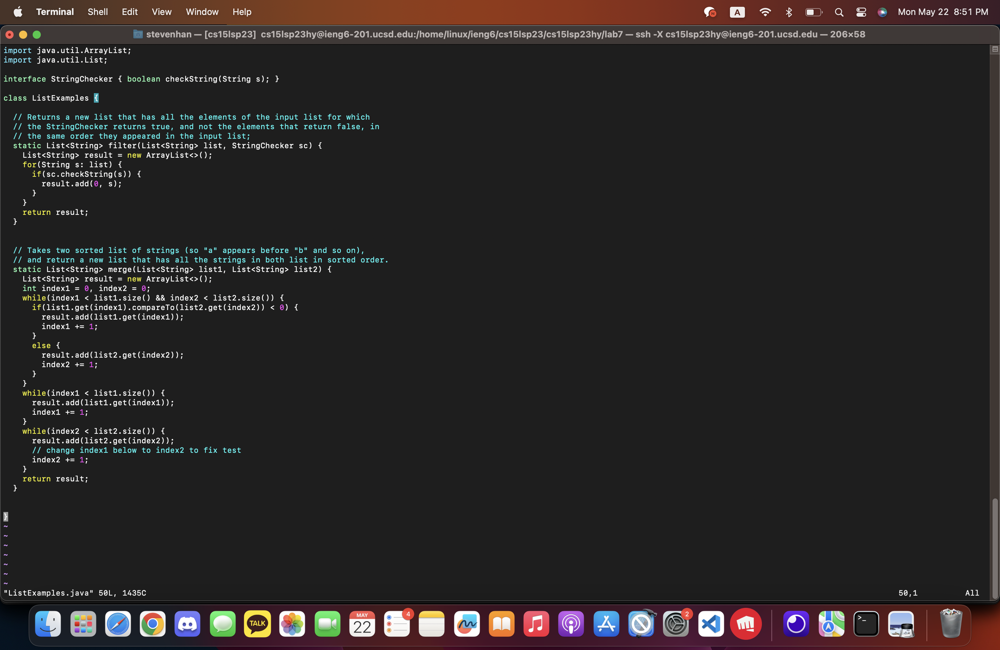
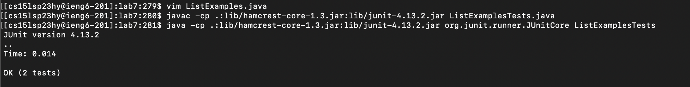
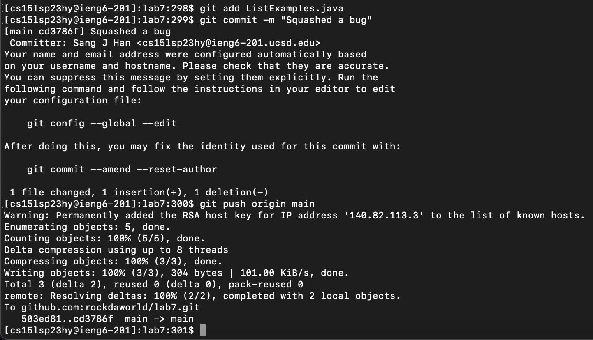

# Lab Report 4 - Sang Jin Han

## Introduction & Goals 

This lab aimed to give students more VIM practice and understanding!
 

This report will go over steps 4 - 9 of the *Timing Tasks* in great detail to express fluency with rudementary VIM techniques. 

## Step 4 - Logging into IENG6

1. Open the terminal
2. Open where login command is copied and copy command
3. Paste and press `<enter>`

## Step 5 - Cloning a Github Repository

1. Now type `git clone https://github.com/rockdaworld/lab7` in your terminal and press `<enter>` to clone your fork of the lab7 repository.

## Step 6 - Running the Tests

1. `cd` into your lab7 directory
2. `ls` to see all the files
3. Now run `javac -cp .:lib/hamcrest-core-1.3.jar:lib/junit-4.13.2.jar ListExamplesTests.java`  and  `java -cp .:lib/hamcrest-core-1.3.jar:lib/junit-4.13.2.jar org.junit.runner.JUnitCore ListExamplesTests`  to see that your code fails the tests.

## Step 7 - Fixing the File
1. Now run the `VIM ListExamples.java` command to open your file in VIM.
2. Keys pressed in VIM: * `/, /, <enter>, <down><right><right>,x, i, 2, <escape>, :, w, q, <enter>`

## Step 8 - Re-running the Tests

1. Now compile and run the tests again, not by copy and pasting but pressing `<up>` four times and pressing `<enter>`.

## Step 9 - Commiting and Pushing

Lastly, run the following commands:
1. `git add ListExamples.java`
2. `git commit -m "<message>"`
3. `git push origin main`
And now it is finished! 

## Conclusion

This lab allowed for greater VIM and git fluency. These are the beginnings to being able to do many things with just the command line, without having to necessarily click away!