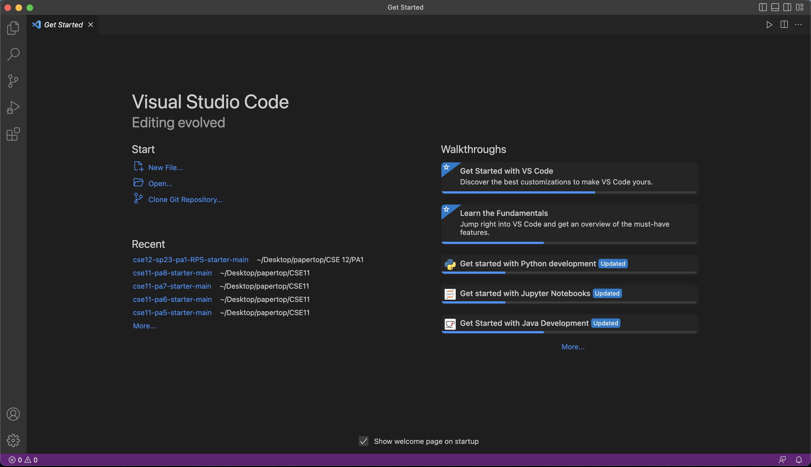
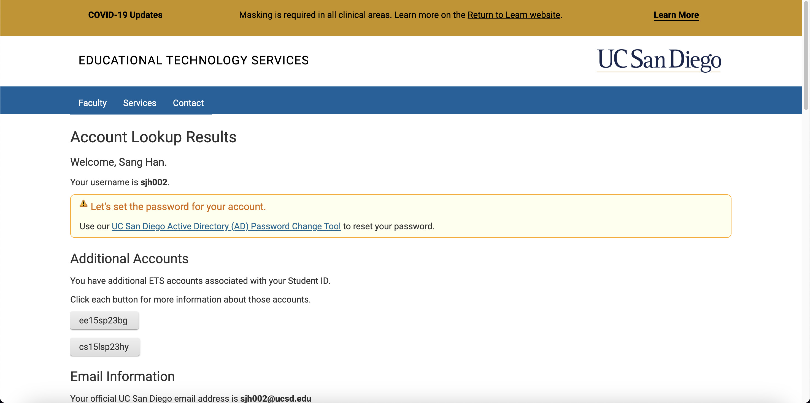
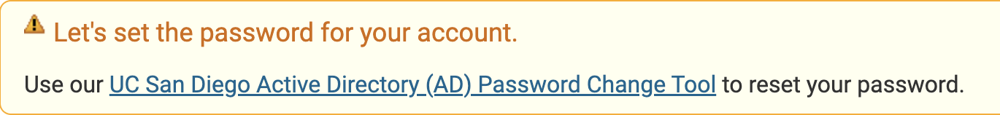
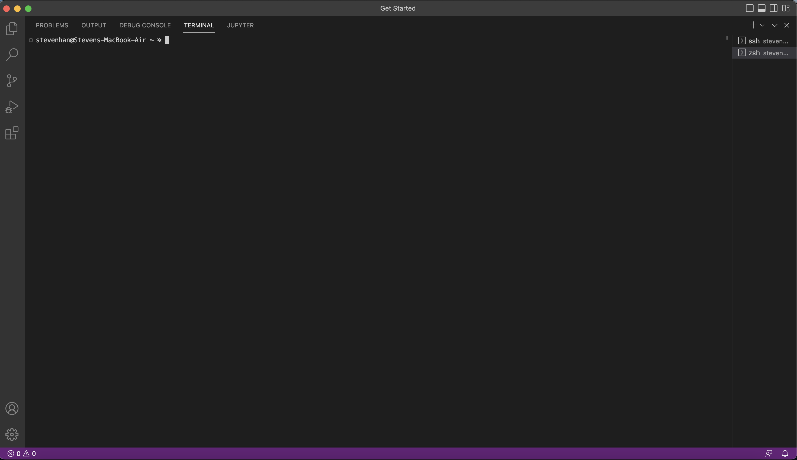
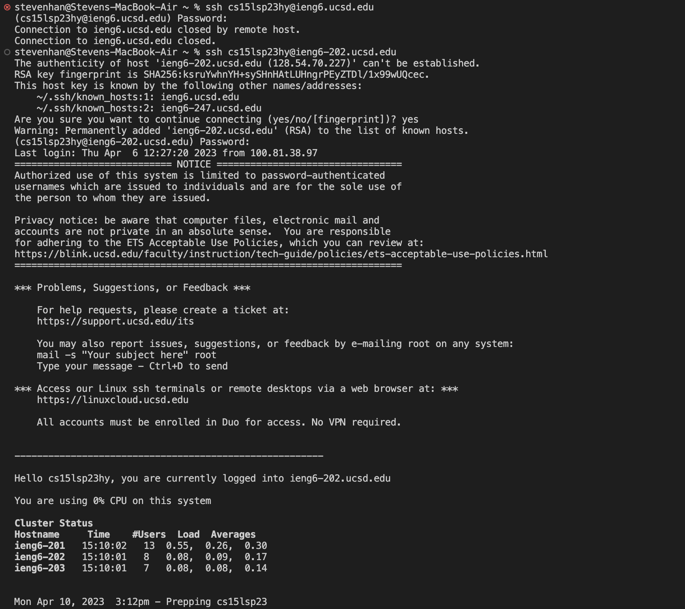

# Lab Report 1 - Sang Jin Han


## Introduction & Goals

Through this page, you will have a clearer understanding of what it means to remotely log-in, what a secure shell (or ssh) is, and how exactly to do and 
use these tools. You will also start to learn some commands that you can utilize to get around the system once logged in.


## Part 1 - Visual Studio Code and SSH

To get started, we must first download [Visual Studio Code](https://code.visualstudio.com/)

Follow the above link to the Visual Studio Code website and install accordingly with your operating system.

After installation, upon opening it should look something like this:



If your Visual Studio Code (Which I will now refer to as "VS Code") looks more blank than mine, don't panic, as my VSC has extra things installed within it.

From here, we'll be opening the integrated terminal (which you can try at this stage by pressing CTRL/Command + ~). Before that, you need to set-up 
your CSE15L course account.

## Part 2 - Your CSE15L Course Account

First, you need to look up your course account here: https://sdacs.ucsd.edu/~icc/index.php

Once you enter, you should be seeing something like this:



Your CSE15L course account will always start with *cs15lsp23* and end with two unique letters.

You should now either copy your specific course account, or remember it, and click the reset password link:



Follow the instructions to change your Course-Specific student account and enter your cse15l username (*Not your ucsd username!*) and follow the 
instructions to change your password (You may have to link your account to DUO).

## Part 3 - Using the SSH and Remotely Connecting

This is the final step of remote connection. If you have completed every step well, we can now turn back to VS Code.

Once you are at the homepage, open the terminal by pressing `CTRL/Command + ~`

Once the terminal is open it should look similar to this:



In the following lines <username> should be replaced with your CSE15L course account username *i.e. cs15lsp23ab*

From here, type the following to login to the ucsd servers: `$ ssh <username>@ieng6.ucsd.edu` (Note that the $ is here just to show what you're typing,
  when typing the command into the terminal, omit the $) and then enter your password. (Your password may not show while you're typing it out for
  security reasons)
  
If you encounter some sort of login error, try the following first: `$ ssh <username>@ieng6-202.ucsd.edu`, and if this doesn't work also, contact the 
  staff on edstem or visit during office hours.
  
From here, if your login is successful, and it is your first time logging into the ucsd system through these means, you may have a prompt asking
  you to type yes/no/fingerprint. If this is your first time, then this is normal, as the system is just doing a routine security check, but the next 
  time you login, it shouldn't ask again. (If it does contact staff) After typing yes, you should be fully logged in and have a terminal that looks
  like this:
  
  

  
  If you have the last part (the cluster status), you're all set and you've finished remotely connecting.
  
 ## Part 4 - Trying Commands
  
  Now that you've logged in, try some commands in the terminal! 
  
  Some important ones are:
  ```
  * pwd   lists the full path leading to the directory you are in
  * ls    lists all the files/directories in your directory
  * cd    changes to root directory
  * cd..  goes to previous directory
  * cat   concatenates the file(s)' contents into the terminal
  ```
  
 Try some of these commands out, get used to them as you will use these for at least the rest of your CSE15L career.
  
  After you're all done with that, make sure to logout using:
  ```
  * CTRL-D
  * Run the command *exit*
  ```
  
  ## Debrief
  
  
  
  Now that you've finished all these steps hopefully you know how to remotely login, you are somewhat familiar with ssh and the terminal as well as
  some useful commands!
  
  
