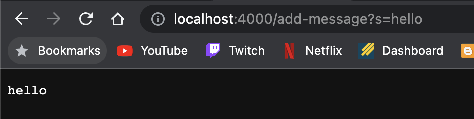
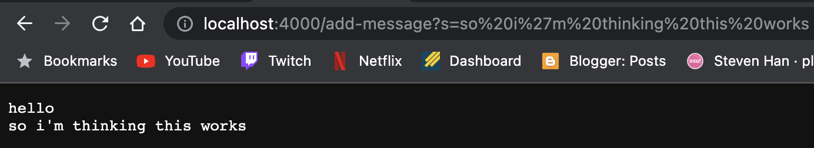
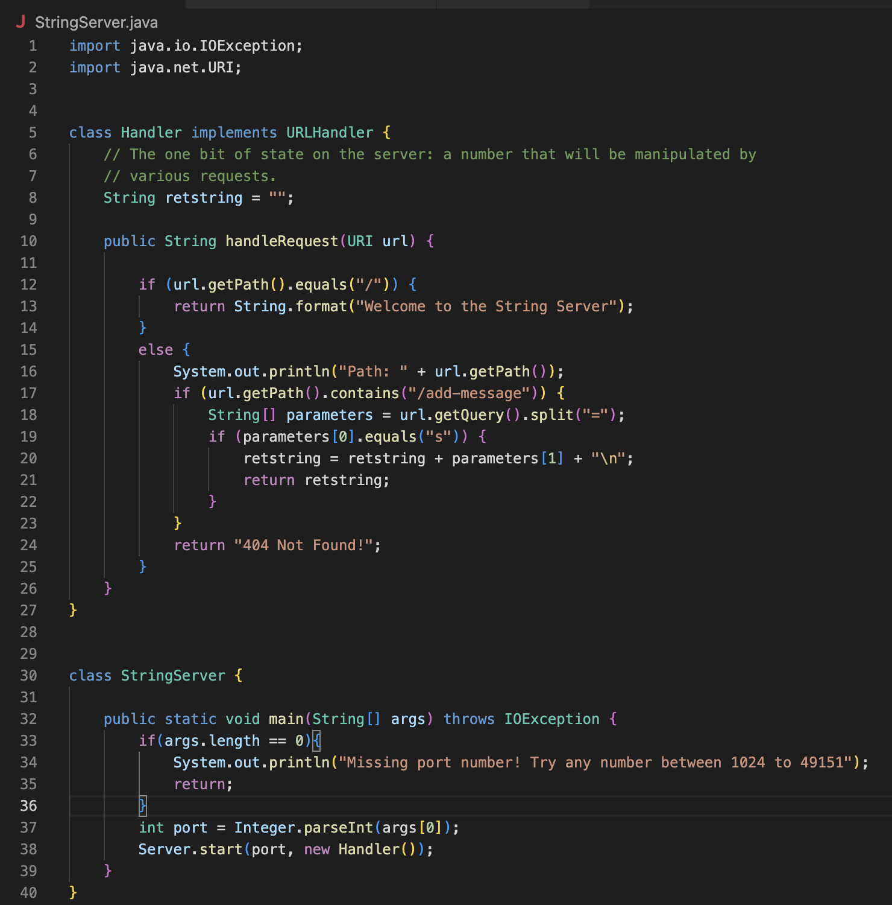

# Lab Report 2 - Sang Jin Han

## Introduction & Goals

This lab aimed to improve server fluency and locating/fixing bugs in code that is not your own.

## Part 1 - String Server

For this first part of the lab, I created a server that took in a path *"/add-message"* and after the query,
took the first argument to return that string on the page. 

Below are a couple examples on how the server functions: 

<u>Screenshot 1:</u>


For this screenshot, the *add-message* method is called. The relevant argument is *s?=hello* and the method appends the string to the right of *=* to the list of returned strings on the server.


<u>Screenshot 2:</u>


For this screenshot, the *add-message* method is called. The relevant argument is *s?=so i'm thinking this works* and the method appends the string to the right of *=* to the list of returned strings on the server.

Following is the code for the server:



For each of the two screenshots of my server, the same method is called. It is the method that adds the message given the correct parameters. These parameters are 1) If the given path contains */add-message* and 2) If after the query *?*, if the left hand side of the *?* is "s". If that is the case, then we append the given search query onto our string, including a new line. If 1) is not satisfied, then we return a psuedo error message. 

## Part 2 - Bugs & JUnit

An example of a failure inducing input for the method *testReverseInPlace()* is given below. 

```
public class ArrayTests {
	@Test 
	public void testReverseInPlace() {
    int[] input2 = {1, 2, 3};
    ArrayExamples.reverseInPlace(input2);
    assertArrayEquals(new int[]{3, 2, 1}, input2);
	}
}
```


An example of the same method with an input that does not induce failure is given:

```
public class ArrayTests {
	@Test 
	public void testReverseInPlace() {
    int[] input1 = { 3 };
    ArrayExamples.reverseInPlace(input1);
    assertArrayEquals(new int[]{ 3 }, input1);
	}
}
```

This was the output (symptom) of running both tests under JUnit:

```
stevenhan@Stevens-MacBook-Air lab3-main % java -cp .:lib/hamcrest-core-1.3.jar:lib/junit-4.13.2.jar org.junit.runner.JUnitCore ArrayTests
JUnit version 4.13.2
.E
Time: 0.005
There was 1 failure:
1) testReverseInPlace(ArrayTests)
arrays first differed at element [2]; expected:<1> but was:<3>
        at org.junit.internal.ComparisonCriteria.arrayEquals(ComparisonCriteria.java:78)
        at org.junit.internal.ComparisonCriteria.arrayEquals(ComparisonCriteria.java:28)
        at org.junit.Assert.internalArrayEquals(Assert.java:534)
        at org.junit.Assert.assertArrayEquals(Assert.java:418)
        at org.junit.Assert.assertArrayEquals(Assert.java:429)
        at ArrayTests.testReverseInPlace(ArrayTests.java:12)
        ... 30 trimmed
Caused by: java.lang.AssertionError: expected:<1> but was:<3>
        at org.junit.Assert.fail(Assert.java:89)
        at org.junit.Assert.failNotEquals(Assert.java:835)
        at org.junit.Assert.assertEquals(Assert.java:120)
        at org.junit.Assert.assertEquals(Assert.java:146)
        at org.junit.internal.ExactComparisonCriteria.assertElementsEqual(ExactComparisonCriteria.java:8)
        at org.junit.internal.ComparisonCriteria.arrayEquals(ComparisonCriteria.java:76)
        ... 36 more

FAILURES!!!
Tests run: 1,  Failures: 1
```

The code associated with this method is:

```
  static void reverseInPlace(int[] arr) {
    for(int i = 0; i < arr.length; i += 1) {
      arr[i] = arr[arr.length - i - 1];
    }
  }
```

Once the bug was fixed the method's code is now:

```
  static void reverseInPlace(int[] arr) {
    for(int i = 0; i < arr.length/2; i += 1) {
      int updateele = arr[i];
      arr[i] = arr[arr.length - i - 1];
      arr[arr.length - i - 1] = updateele;
    }
  }
```

The reason why the second input did not fail the test was due to the fact that there was only one element in the array. 
The failure inducing part of the method can be found in the fact that the initial indexes will get replaced by the last
indexes without updating the last indexes of the array, resulting in not being able to eventually change the last indexes.

Thus the bug was fixed by saving the element before overwriting it in the for loop, and after the first elements of the array are changed, 
the last elements are updated immediately after with the saved element. 
We also had to change how many times the loop runs in order to not reverse the indexes again as all the elements are already accounted for
when reaching the "halfway" point of the length of the given array.

## Part 3 - Reflection

Something new I've learned in weeks 2 and 3 of lab was coding and creating a server with the java URI class. I personally had trouble
returning the string of statements and had to land on concatenation of a string variable after a good while of bug fixing. 
In terms of the bug fixing aspect of the week 3 lab, not much new was learned as I already have had experience with JUnit through CSE 12 
and bug fixing through various other programming classes. 
