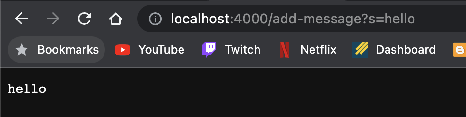
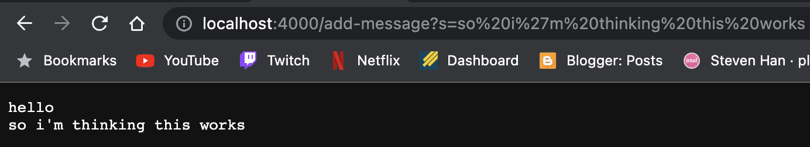
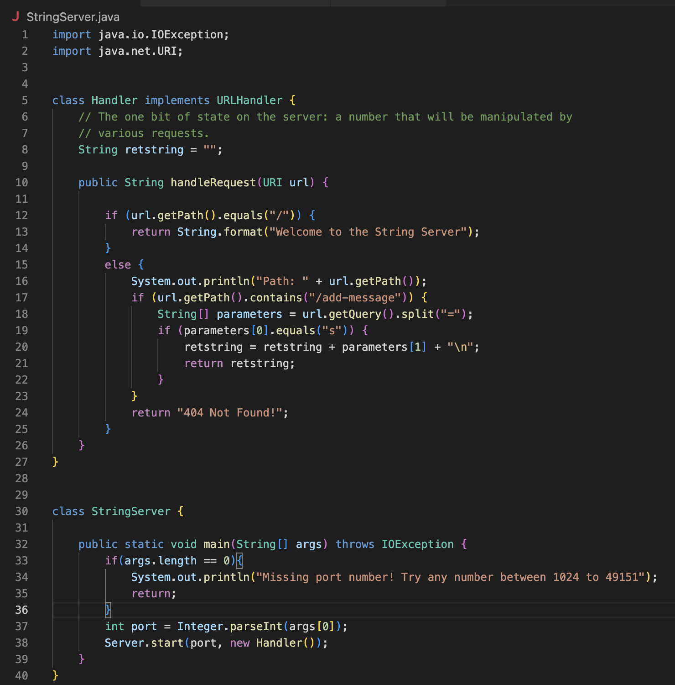

# Lab Report 2 - Sang Jin Han

## Introduction & Goals

This lab aimed to improve server fluency and locating/fixing bugs in code that is not your own.

## Part 1 - String Server

For this first part of the lab, I created a server that took in a path *"/add-message"* and after the query,
took the first argument to return that string on the page. 

Below are a couple examples on how the server functions: 

Following is the code for the server:

## Part 2 - Bugs & JUnit

## Part 3 - Reflection

