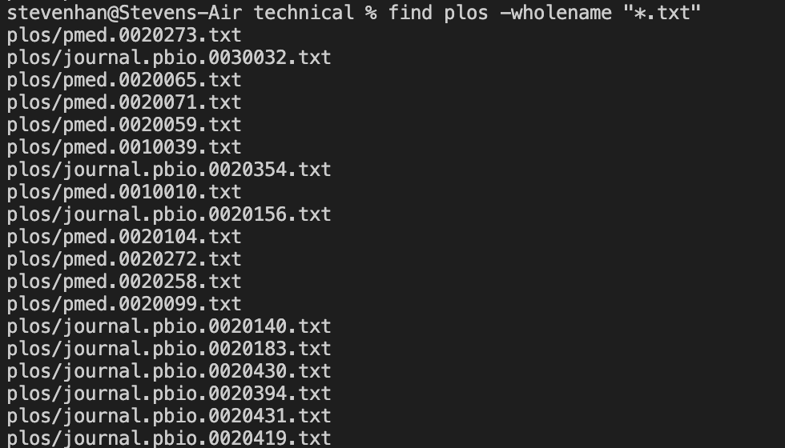

<html>
<h1>Lab Report 3 - Sang Jin Han</h1>

<h2>Introduction and Goals</h2>

This lab was a deeper dive into terminal commands. The goal was to familiarize ourselves with these commands in order to be more fluent in using our terminals effectively. Some of these commands included less, find, and grep, in which in this report, I will be researching further into the <em>find</em> command.

<h2>Researching the <em>find</em> command</h2>

My research started with looking into what other options the find command has. I first looked at  
<a href="https://linuxize.com/post/how-to-find-files-in-linux-using-the-command-line/#find-files-by-modification-date"><em>this</em></a>
page on the find command.

<h2>The <em>type</em> option</h2>

 The first option that I dove deeper into was the <em>type</em> command. This command allows the user to specify a specific descriptor from the list:  
<ul>
    <li>f - regular file</li>
    <li>d - directory</li>
    <li>l - symbolic link</li>
    <li>c - character devices</li>
    <li>b - block devices</li>
    <li>p - named pipe</li>
    <li>s - socket</li>
</ul> 

 
In this first screenshot, I used the <em>d</em> descriptor with the type option. This shows all the directories in the specified directory, in this case the current working directory. 

 
For the second instance of using find, I called it with the desciptor, f, in the plos directory. This simply returned all the files in the given directory.

<h2>The <em>size</em> option</h2>

The size option is, as the name suggests, an option where you can input a size criteria:
<ul>
    <li>b - 512-byte blocks (default)</li>
    <li>c - bytes</li>
    <li>w - two-byte words</li>
    <li>k - kilobytes</li>
    <li>M - megabytes</li>
    <li>G - gigabytes</li>
</ul> 
in which the terminal then returns the files/directories that matches the given criteria.

 
In this usage of the size option, I used it in conjuction with the type option with the file descriptor in order to look for only files with a size of more than 200 kilobytes.

 
This next one perplexes me a little, as the <em>du -h</em> command shows the sizes of all the directories in the current working directory. However, when using the size option in conjunction with the type option here, it doesn't seem to be showing the directories correctly.

<h2>The <em>user</em> option</h2>

The user option allows for the user to find the files/directories that the specified user has access to.

 
In this use of user, in conjuction with size to limit the search field, as my user has administrator permissions on this computer, it shows all files that match the size parameter.

 
In this use of user, I inputted a non-existing user on this computer to see what would happen. It naturally resulted in an error and thus no files being returned.

<h2>The <em>path/name/wholename</em> options</h2>

This last bit of research was done on the path/name/wholename options which seem to be differently named options that behave very similarly.  
wholename:
 
name:
 
path:
 

All three of these when, given the same pattern, at least in this instance, have the exact same outputs.

<h2>Conclusion</h2>

This lab report found a greater breadth of options to use in day-to-day terminal usage. The user option may be useful if I were a tutor and had higher level access than students and wanted to check if they had access to a certain directory or file in the ieng servers. The size option is also simply useful to weed out unwanted things, as well as the type option. However, the most useful idea is using these ideas in conjuction to specify more exactly to my needs/wants.

</html>