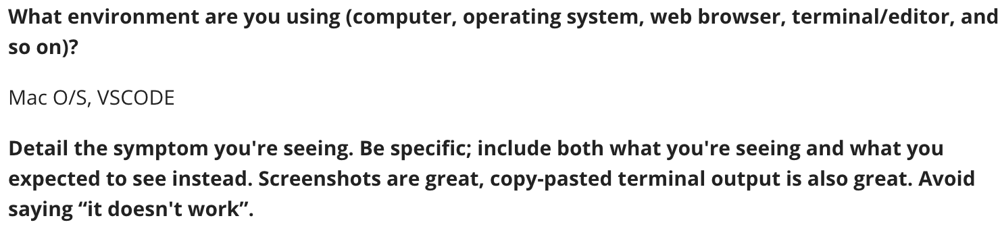
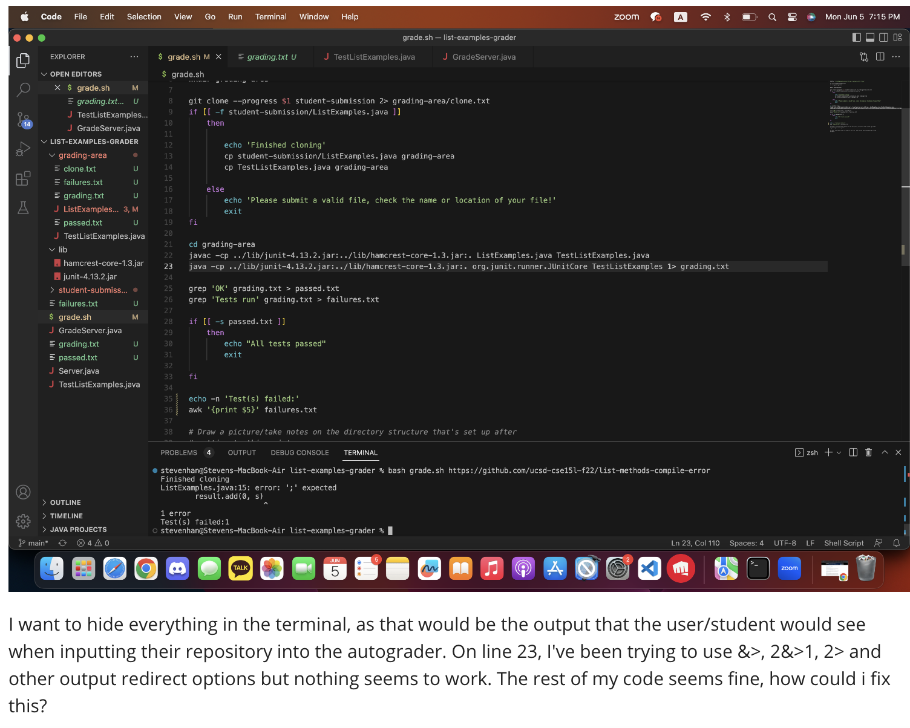
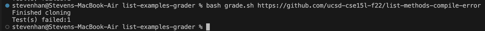

# Lab Report 5 - Sang Jin Han

## Introduction & Goals

This lab aimed to further our understanding of both the instructor's
perspective as well as debugging and bash scripts.

 

This report will go through a debugging scenario of an
imaginary student asking a question on EDStem to a TA
where I take the role of both student but primarily the TA.

## Receiving the Question

An example scenario of a student asking for help debugging would
be as follows:

*note: the student was asking how they could hide the part of the terminal output where it shows the actual error i.e. the missing semi-colon*

 

Where this student is asking for help whilst being somewhat
clear as to their problem and what steps they have made in 
order to debug themselves.

## Answering the Question

The error may not be from what you are doing directly in line 23. A good question to think about in this scenario is, "When exactly do we see these kinds of errors in the terminal? Is it during the actual running of the java file, or perhaps somewhere else?"

 

Try to seek the answer to this question first as the next step forward. The answer may be a lot simpler than you think!

## After the Answer

When figuring out what to do for this lab, I looked at how my autograder script was actually working and was confused as to why I got this output in the terminal. The way forward was by literally asking myself the question the "TA" asked the student, which resulted in a simple solution:

 

The solution to the bug was simply redirecting the compiler step's standard-error output to another file!

## CSE15L 2nd Half Reflection

Bash scripts seem like a very important tool to have under someone's belt. Whenever I write tests and have written tests in JUnit in the past in CSE11/12, I always copy paste the whole "CPATH" line and edit it to fit my needs and then to re-run it I would double press the up-arrow and press enter and repeat that process. 

 

Now it seems like I have a much better tool to do things as repetitive as this, and if I really wanted to, I could make my own general purpose auto-grader for PAs to dissect errors better.

 

I also think VIM would be a great tool, and speaking to other friends about this, I understand that not only was it a great tool when IDEs were not as good in the past for general purpose editing and coding, but it's a great tool when one would not have much mmemory on whatever machine they were using.

 

Overall, this class has been pretty useful and I've been able to learn a lot of cool things thanks to all the hard work of the staff! Thank you!